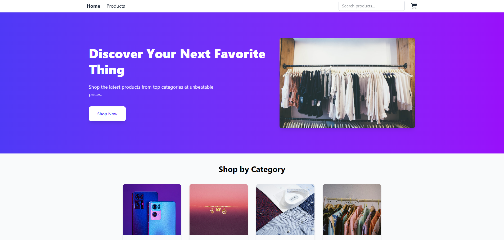
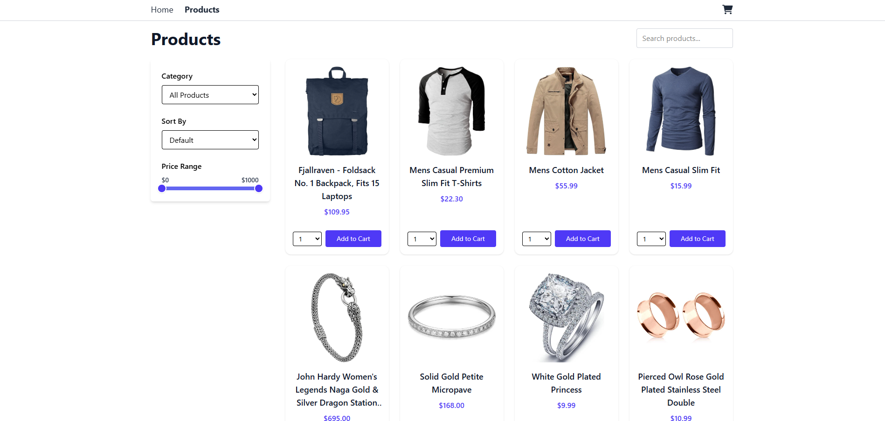
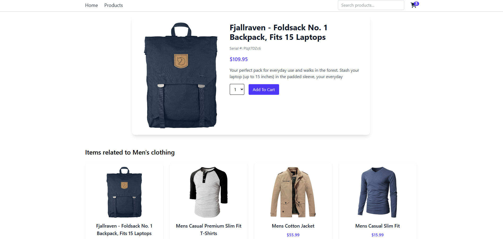
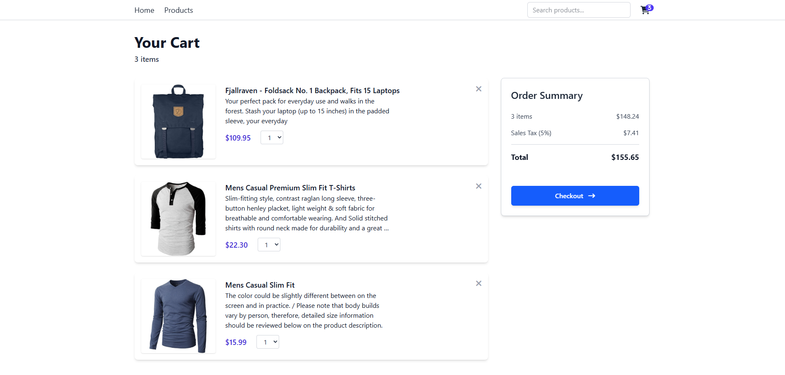
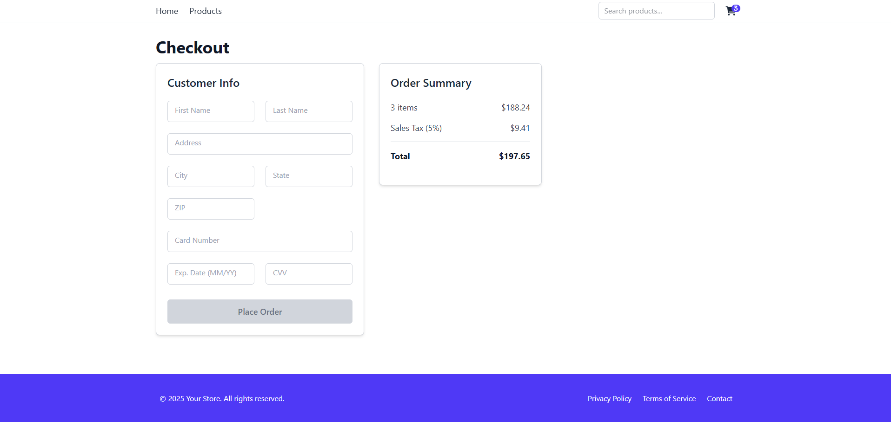
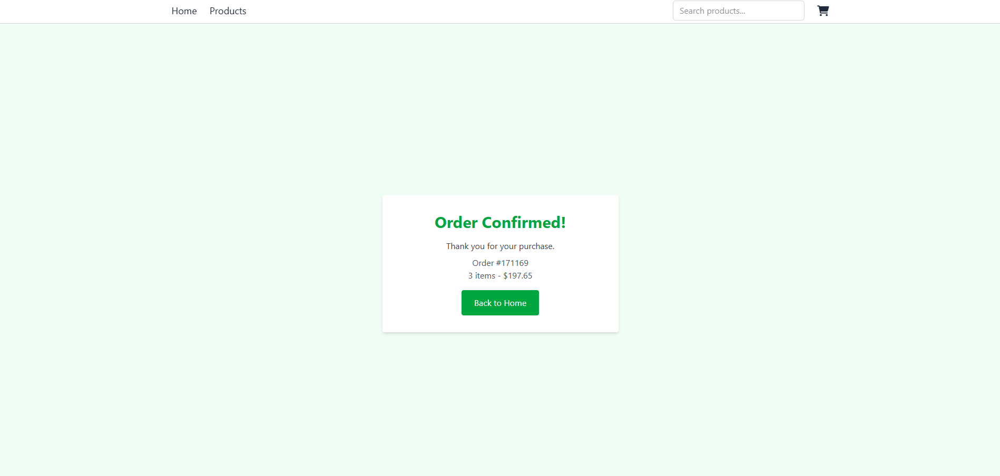
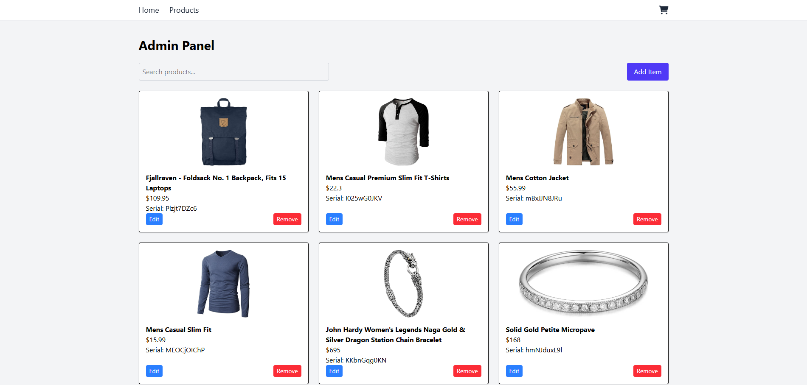

# 🛒 E-Commerce Site

A complete online shopping platform that allows users to browse products, manage their cart, and securely place orders. Designed to deliver a smooth and engaging shopping experience from browsing to checkout.



---

## 🚀 Features

- 🛍️ **Product Catalog** with detailed product pages
- 🛒 **Shopping Cart** with add, remove, and quantity update functionality
- 🔍 **Search and Filter** products by category and name, and price
- ↕️ **Sort** products by category and name alphabetically
- 🧾 **Checkout Process** with customer info, payment form, and order review
- ✅ **Order Confirmation** and summary page after successful purchase
- ⚙️ **Admin Dashboard** to add, edit, and remove products
- 📱 **Responsive Design** optimized for desktop and mobile
- 🔄 **State Management** for smooth UI updates and performance

---

## 🛠️ Tech Stack

- **Frontend**: React, Redux, Tailwind CSS

---

## 📦 Installation

```bash
# Clone the repository
git clone https://github.com/your-username/ecommerce-site.git
cd ecommerce-site

# Install dependencies for frontend and backend
npm install

# Run frontend and backend servers
npm run dev

Open your browser and visit http://localhost:5173 to view the application
```

## 📷 Screenshots

<p>
  
  <br/>
  <em>Landing page of the ecommerce site</em>
</p>
<p>
  
  <br/>
  <em>Products page</em>
</p>
<p>
  
  <br/>
  <em>Detailed view of an individual product</em>
</p>
<p >
  
  <br/>
  <em>Cart page</em>
</p>
<p >
  
  <br/>
  <em>Checkout page</em>
</p>
<p >
  
  <br/>
  <em>Order Success page</em>
</p>
<p >
  
  <br/>
  <em>Admin view</em>
</p>
